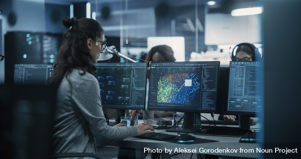
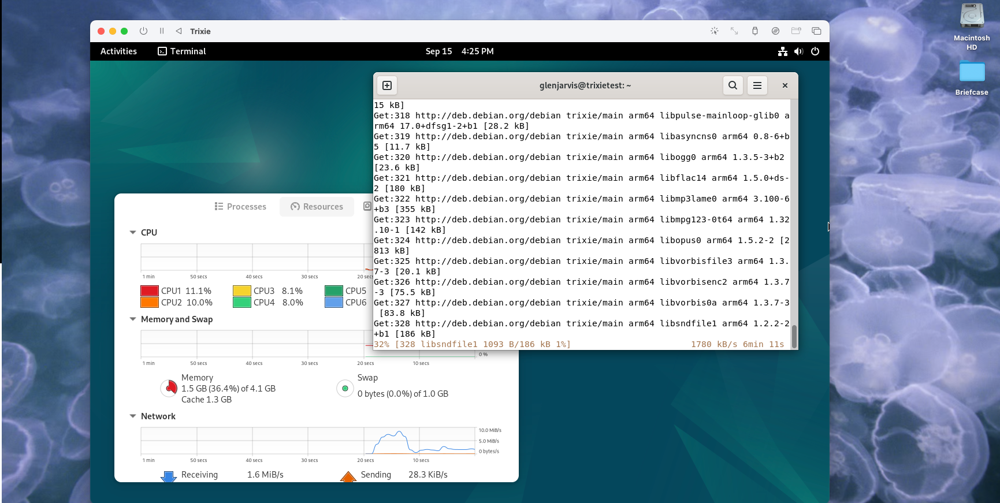
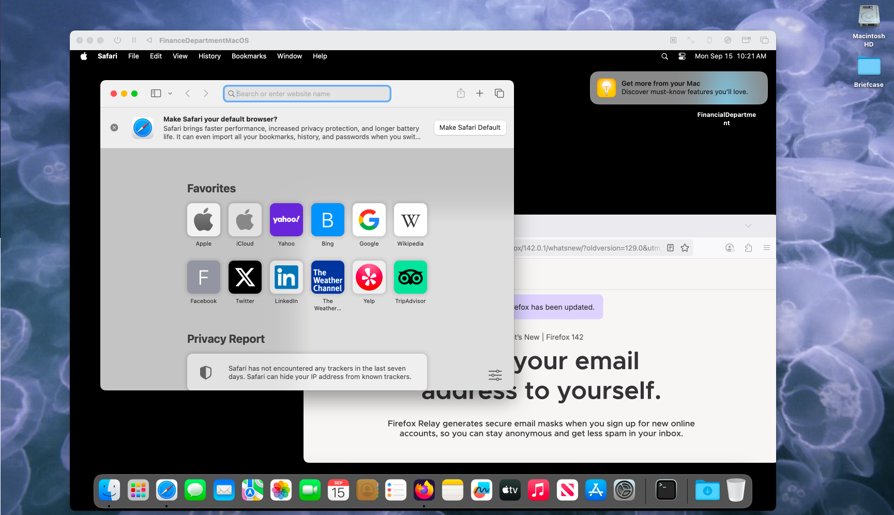
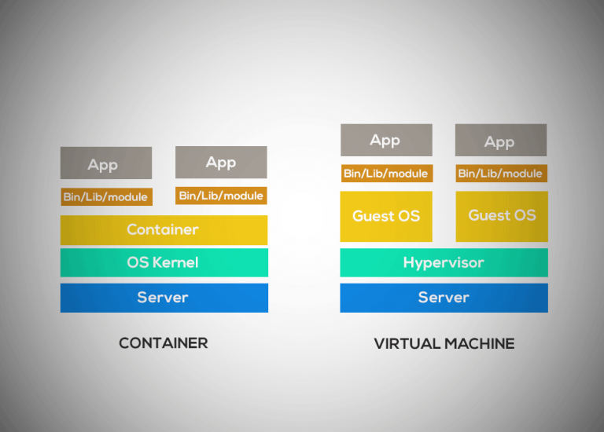

Advance to next slide to start

<!--
Presenter Notes (Slide 1 - Advance)
-->

---


<!--
Presenter Notes (Slide 2 - Cover)
- Thank you, Eric.
- I would like to start by thanking Remake Labs for sponsoring this Tech Talk
- Time: 00:06
-->
---

# Level Up Your Developer Onboarding<br/>with Dev Containers

_Sponsored by **Remake Labs**_


<div class="grid grid-cols-2 gap-8 items-center">

<div>

- Hired new Software Developer

- They have badge, new computer and login creds

- First assignment?

</div>

<div>



</div>

</div>


<!--
Presenter Notes (Slide 3 - Title)
- My name is Glen Jarvis and today, I will show you how to use Dev Containers
- to onboard your new developers in minutes.
- Finally! You got the headcount for a new software developer for your team
- They just received their badge, new computer and login credentials.
- And, what is the first ticket that you give them?
- Time: 00:24

Image: Engaged Young Engineer Working on Computer in a Technological Office Environment. by Aleksei Gorodenkov from <a href="https://thenounproject.com/photo/engaged-young-engineer-working-on-computer-in-a-technological-office-environment-0K8aLY/" target="_blank" title="Engaged Young Engineer Working on Computer in a Technological Office Environment. Photo">Noun Project</a> (CC BY-NC-ND 2.0)
-->

---

# First assignment: Set Up Environment
_Setup Environment_

<div class="relative flex items-start justify-center min-h-[70vh] text-center">

  <!-- Background image -->
  <div class="absolute inset-0 -z-10 opacity-10 bg-[url('./assets/noun/np_Engaged_Young_Engineer_Working_on_Computer_in_a_Technological_Office_Environment._0K8aLY_free.jpg')] bg-cover bg-center"></div>

<div class="max-w-2xl justify-start text-left" >

- Assignment: Build their environment

- Clone Repo

- Configure laptop to run repo (hours, days or weeks?)

</div>

</div>


<!--
Presenter Notes (Slide 4 - Assignment)

- Configuring their development environment, of course.
- So, they clone the repository
- And, then, how long to setup and configure the laptop?
- Is it hours or days?

- Time: 00:35

Image: Engaged Young Engineer Working on Computer in a Technological Office Environment. by Aleksei Gorodenkov from <a href="https://thenounproject.com/photo/engaged-young-engineer-working-on-computer-in-a-technological-office-environment-0K8aLY/" target="_blank" title="Engaged Young Engineer Working on Computer in a Technological Office Environment. Photo">Noun Project</a> (CC BY-NC-ND 2.0)
-->

---

# How much time is needed?
_Days or Weeks?_


<div class="relative flex items-center justify-center min-h-[70vh] text-center">

  <!-- Background image -->
  <div class="absolute inset-0 -z-10 opacity-20 bg-[url('./assets/noun/np_Spanish_student_checking_the_time_while_sitting_at_a_table_near_computer_0JxKp4_free.jpg')] bg-cover bg-center"></div>

  <div class="max-w-2xl">
    <h2 class="text-2xl font-bold mb-4">Unicorn Project</h2>
    <p class="mb-6">
      Maxine Chambers — a senior developer —<br />
      spent <strong>two weeks just to set up her laptop</strong>.
    </p>
  </div>
</div>


<!--
Presenter Notes (Slide 5 - Estimating Time)

- We expect it will be less than an hour
- In my personal experience, it can be days
- In the book "The Unicorn Project", it took a very senior developer
- Maxine Chambers, two weeks to configure her laptop

Image: Spanish student checking the time while sitting at a table near computer by Scopio from <a href="https://thenounproject.com/photo/spanish-student-checking-the-time-while-sitting-at-a-table-near-computer-0JxKp4/" target="_blank" title="Spanish student checking the time while sitting at a table near computer Photo">Noun Project</a> (CC BY-NC-ND 2.0)

- Time: 00:47
-->

---

# Start simple
_Build the basics before scaling the complex_

<br />
<div class="relative">

  <!-- Background image -->
  <div class="absolute inset-0 -z-10 opacity-10 bg-[url('./assets/deno.png')] bg-no-repeat bg-center bg-cover"></div>

<div class="grid grid-cols-2 gap-8 items-start">

<div>

## Typical Setup

- Brew

- NPM

- Postgres

- MongoDB

</div>

<div>

## Slidev

- Deno

- In-house binary executables

- (Manually compiled on only some OSes)

- Special Library dependencies

</div>

</div>
</div>


<!--
Presenter Notes (Slide 6 - Typical Setup)

- But, let's start with a simple example.
- Maybe we have to install Brew, NPM, Postgres, and MongoDB,
- which could be installed fairly quickly.
- But, what if we have to install Deno or in-house binary executables
- that are only compiled on certain Operating Systems or
- have special library dependencies?
- Depending upon the experience level of the engineer, this may take some time.

- Time: 01:16
-->
---

# Today
_Our experience together_

<div class="relative">

  <!-- Background image -->
  <div class="absolute inset-0 -z-10 opacity-10 bg-[url('./assets/deno.png')] bg-no-repeat bg-center bg-contain"></div>

<div class="grid grid-cols-2 gap-8 items-start">

<div>

## Deno

- Security: File, Network, Environment

- Default TypeScript (no tsconfig, ts-node, Babel)

- Dependency Model: Import from URLs

- Batteries Included (library, test runner, linter, formatter, bundler)

- Modern API design (ES Modules: Not CommonJS)

</div>

<div>

## Slidev

- Write slides in Markdown

- Style with CSS

- Live coding components, interactivity

- Export to PDF, PNG, or host as a website

</div>

</div>
</div>

<!--
Presenter Notes (Slide 7 - Our experience)

- In our example together today, we are going to install Deno and Slidev.
- Deno is like Node/NPM and can be used instead of Node.js.
- It is more secure (file, network and environment access has to be explicitly granted)
- It has a modern API design (No more CommonJS)
- It will still work with NPM modules.
- And, it supports TypeScript by default

- And Slidev is a program that generates slides from Markdown, and
- can include custom styling, interactivity, etc.
- I am using Slidev right now, running on Deno to give you this presentation.

- Time: 01:54
-->

---

# How long to configure this environment?
_An hour? A day?_

<div class="grid place-items-center">


</div>

<!--
Presenter Notes (Slide 8 - How long to configure)

- If I asked you right now, how long would it take you to
- configure this Deno environment?
- Do you think it would take more than an hour?

- Let's do it together right now.
- Or rather, let me show you a recorded video of when I did it to
- launch this presentation.
- Here is what it took me to get Deno setup and launch slidev on this computer for
- this presentation.

- Time: 02:16

Image: Spanish student checking the time while sitting at a table near computer by Scopio from <a href="https://thenounproject.com/photo/spanish-student-checking-the-time-while-sitting-at-a-table-near-computer-0JxKp4/" target="_blank" title="Spanish student checking the time while sitting at a table near computer Photo">Noun Project</a> (CC BY-NC-ND 2.0)
-->

---

<Video src="./assets/launch-deno-slidev.mp4" controls autoplay muted playsinline />


<!--
Presenter Notes (Slide 9 - Video install)

Play video and walk through the steps, watching the video and talking

- Time: 02:56
-->

---

# Hands-off Configuration
_Two files in Repo and extension_

<div class="grid grid-cols-2 gap-8 items-start">

<div>
<br />

```
$ ls .devcontainer
devcontainer.json	Dockerfile
```

</div>

<div>

- No Deno installed on my computer

- No Slidev installed on my computer

- VS Code Dev Containers

</div>

</div>


<!--
Presenter Notes (Slide 10 - Next)

- I don't have Deno installed on my computer.
- I don't have SlideDev installed on my computer.
- But, because I have two files in my repository,
- and I have a VSCode Extension,
- VSCode is able to configure a very portable Dev Container
- that contains both Deno and Slidev.
- (beat)
- If you cloned my repo, ensured you had the
- VS Code Dev Containers extension installed,
- you would get both Deno and Slidev as well,
- even if you didn't install either one on your computer.
- So, yeah, this is a pretty easy setup.
- Literally, clone, and open.

- Time: 03:30

Image: Cropped image of young woman in shorts showing off the painting on her hand by Scopio from <a href="https://thenounproject.com/photo/cropped-image-of-young-woman-in-shorts-showing-off-the-painting-on-her-hand-0J2qd0/" target="_blank" title="Cropped image of young woman in shorts showing off the painting on her hand Photo">Noun Project</a> (CC BY-NC-ND 2.0)
-->

---

# .devcontainer/devcontainer.json

<div class="grid grid-cols-1 gap-8 items-center">

<code>
```
{
  "name": "Slidev + Deno Dev Container",
  "build": { "dockerfile": "Dockerfile", "context": ".." },
  "forwardPorts": [3030],
  "portsAttributes": {
    "3030": { "label": "Slidev dev server", "onAutoForward": "notify" }
  },
  "customizations": {
    "vscode": {
      "extensions": [
        "denoland.vscode-deno",
        "Vue.volar",
        "esbenp.prettier-vscode"
      ],
      "settings": {
...
      }
    }
  },
  "remoteUser": "vscode",
  "updateRemoteUserUID": true,
  "postCreateCommand": "deno --version && slidev --version || true"
}
```
</code>
</div>


<!--
Presenter Notes (Slide 11 - devcontainer.json)

- How is this done?
- In this demo, this is done with magic of two files.
- Here is the first, a devcontainer.json file
- It is used to integrate with an IDE such as VSCode.
- And, it's the main subject of this talk.
- It is a structured JSONC (JSON with comments) file.
- Details for configuring these files are at the `containers.dev` website
- To "start small and see how it goes", feel free to clone this repository
- and review this example.

- Time: 03:52
-->
---

# .devcontainer/Dockerfile
_Container blueprint_

<div class="grid grid-cols-1 gap-8 items-center">

<code>
```
FROM mcr.microsoft.com/devcontainers/base:jammy

# Install dependencies and Deno
USER root
RUN apt-get update && apt-get install -y --no-install-recommends \
...

# Switch to vscode before installing Deno to keep everything user-owned
USER vscode
ENV DENO_INSTALL=/home/vscode/.deno
...
RUN deno install -g -A npm:@slidev/cli && slidev --version || true

EXPOSE 3030
...
```
</code>

</div>


<!--
Presenter Notes (Slide 12 - Dockerfile)

- And, here is the container configuration: The .devcontainer/Docker file.

- This brief glance is to show how one can have two files checked into a code repo
- so that a consistent environment can be launched
- (if a user wants it).
- Your new developers can hit the floor running on day 1.
- Hopefully, by now, you can see the benefit of configuring a code repo with the Dev Container configuration.
- You get portability and an easy setup regardless of the dependencies of the project.

- Time: 04:52
-->

---
background: ./assets/matrix-background.jpg
backgroundSize: cover
backgroundPosition: center
class: 'text-white'
---

# Catch-up
_Plan for talk_


<!-- background (theme-proof) -->
<div class="absolute inset-0 -z-10">
  <div class="absolute inset-0 bg-[url('./assets/noun/np_Woman_Sitting_in_Crowded_Audience_at_Business_Conference._0gXB7j_free.jpg')] bg-center bg-cover opacity-10"></div>
  <!-- optional extra contrast: dim tint on top of the image -->
  <div class="absolute inset-0 bg-black/25"></div>
</div>

<!-- foreground -->
<div class="relative z-10 px-8 py-6 text-black">
  <ul class="list-disc ml-6 space-y-2">
    <li>Catch-up
      <ul class="list-disc ml-6 space-y-1">
        <li>Virtual Machines</li>
        <li>Containers</li>
      </ul>
    </li>
    <li>Dev Containers</li>
  </ul>
</div>


<!-- Presenter Notes (Slide 13 - Overview)

- Now, I would like to outline what we'll discuss for the remainder of this talk.
- First, we'll rewind and catch-up any audience members who may not know what a container is.
- For that, we'll start with the concept of a virtual machine.
- And, then we'll build on that concept, introducing containers, and then contrasting the two.
- After all of that, we will then do a deeper technical dive into Dev Containers before we wrap up.

- Time: 05:19

Image: Woman Sitting in Crowded Audience at Business Conference. by Aleksei Gorodenkov from <a href="https://thenounproject.com/photo/woman-sitting-in-crowded-audience-at-business-conference-0gXB7j/" target="_blank" title="Woman Sitting in Crowded Audience at Business Conference. Photo">Noun Project</a> (CC BY-NC-ND 2.0)
-->

---

# Virtual Machines
_A computer inside your computer_


<!-- background (theme-proof) -->
<div class="absolute inset-0 -z-10">
  <div class="absolute inset-0 bg-[url('./assets/matrix-background.jpg')] bg-center bg-cover opacity-30"></div>
  <!-- optional extra contrast: dim tint on top of the image -->
  <div class="absolute inset-0 bg-black/25"></div>
</div>

<!-- foreground -->
<div class="relative z-10 px-8 py-6 text-black">
  <ul class="list-disc ml-6 space-y-1">
    <li>Simulate all the chips of a real computer</li>
    <li>Full guest OS running on top of host</li>
    <li>Heavy but flexible</li>
  </ul>
</div>


<!--
Presenter Notes (Slide 14 - Virtual Machines)

- Imagine for a moment that I wrote a program that simulated a computer chip.
- This is done a lot when people are designing chips.
- And, what if we combined that simulation of a chip with the simulation of another chip?
- And, what if we combined all of those chips to build an entire computer, in software,
- from the ground up, by simulating all of the chips inside of it?

- Time: 05:39
-->

---

# Minecraft Computer
_A computer inside a game_


<!--
Presenter Notes (Slide 15 - Minecraft Computer)

- This is not as far fetched as you may think.
- In the video game Minecraft, there is an element called Redstone.
- Several Redstone elements can be put together that simulate a transistor.
- A transistor is the building blocks of chips.
- This image is computer that was built inside of Minecraft
- It really is a computer inside of a game which is inside of a computer

- Time: 06:02
-->

---

# My macOS Running Linux
_A Linux computer inside of a macOS computer_



<!--
Presenter Notes (Slide 16 - Linux on Mac)

- Here is a screenshot of my macOS computer.
- I have a Debian Linux virtual machine running.
- So, if there's a program that isn't available on Mac,
- I can still use it.
- If there is a program on Windows that I need, I can run that program
- in a virtual machine.

- Time: 06:19
-->
---

# My Mac inside a Mac
_Turtles all the way down_



<!--
Presenter Notes (Slide 17 - Mac in Mac)

- Here is another example.
- In this screenshot, I have a macOS computer running inside a macOS computer.
- That's pretty cool.
- In my example, they are running different versions of macOS.

- Time: 06:32
-->
---

# Benefits of Virtual Machine
_A computer in a computer_

<!-- background (theme-proof) -->
<div class="absolute inset-0 -z-10">
  <div class="absolute inset-0 bg-[url('./assets/noun/np_Background_for_computer_technology_0KMydM_free.jpg')] bg-center bg-cover opacity-15"></div>
  <!-- optional extra contrast: dim tint on top of the image -->
  <div class="absolute inset-0 bg-black/5"></div>
</div>

<!-- foreground -->
<div class="relative z-10 px-8 py-6 text-black">
  <ul class="list-disc ml-6 space-y-1">
    <li>Isolation</li>
    <li>Flexibility</li>
    <li>Portability</li>
    <li>Testing & Experimentation</li>
    <li>Legacy Support</li>
  </ul>
</div>

<!--
Presenter Notes (Slide 18 - Benefits of a VM)

- Virtual Machines have several benefits
- For example, a Virtual Machine can be completely isolated from my main computer.
- If I have a virus on my virtual machine, it is separate from my main computer.
- (beat)
- I also get a lot of flexibility.
- If I need something from a different operating system,
- I could install a small virtual machine for that Operating System.
- I could setup a shared virtual hard disk that both computers have access to,
- so they can share data.
- (beat)
- I also get portability.
- I can copy the virtual machine hard disk to another computer.
- And, when I boot it up, I will still have all of my data, preferences, etc in my virtual machine running on a different computer.
- (beat)
- Virtual Machines are a great way to experiment without messing up your main computer.
- For example, I just installed the latest macOS (Tahoe) on that virtual machine I was showing earlier.
- I could ensure that all of the programs that I use still work on it before I upgrade my main computer.
- (beat)
- And, finally, if there is some legacy program that just can't be installed on a new Operating System,
- it can still run using a virtual machine on an older OS.

- Time: 07:34
-->
---

# Drawbacks of Virtual Machine
_A computer in a computer_

<!-- background (theme-proof) -->
<div class="absolute inset-0 -z-10">
  <div class="absolute inset-0 bg-[url('./assets/noun/np_Background_for_computer_technology_0KMydM_free.jpg')] bg-center bg-cover opacity-15"></div>
  <!-- optional extra contrast: dim tint on top of the image -->
  <div class="absolute inset-0 bg-black/5"></div>
</div>

<!-- foreground -->
<div class="relative z-10 px-8 py-6 text-black">
  <ul class="list-disc ml-6 space-y-1">
    <li>Heavyweight</li>
    <li>Resource intensive</li>
    <li>Slow Boot & Performance</li>
  </ul>
</div>

<!--
Presenter Notes (Slide 19 - Drawbacks of a VM)

- Virtual Machines have several drawbacks too
- For example, a Virtual Machine can be be pretty heavy.
- You have to install an entire operating system, just to use one program from that operating system.
- (beat)
- And, this can resource intensive.
- We have found clever ways to be more efficient.
- Under certain circumstances, the virtual machine doesn't have to be a program running simulated hardware.
- Instead, it can share the resources with the "main" computer.
- We'll call this "main" computer the "host" computer from now on.
- But, even then, this emulation of hardware is pretty slow.
- So, for example, getting a video game made for Windows to run in an virtual machine is a very challenging task.
- Often it just isn't practical.
- (beat)
- It's slow to boot up a whole virtual machine to run one small program.
- And, often we only need that one small program to run.

- Time: 08:30
-->
---

# Containers
_**Tiny** hard drives for a single program_


<div class="grid grid-cols-2 gap-8 items-start">

<div>

- Virtual Machine OS size: 15-30 GB
- Container size: 5-10 MB (Alpine)
- Busy Box container size: 1 MB
- Tens of thousands of container images: Single iPhone

</div>

<div>



</div>

</div>
<!--
Presenter Notes (Slide 20 - Introducing Containers)

- Think of just how much is in a full operating system.
- Do I need Firefox or Chrome to be installed just to run a program like Node.js?
- (beat)
- The image to the right shows a Virtual Machine.
- Just like we called the "main" computer the "Host" computer,
- we'll call the virtual machine that is running the "Guest" computer.
- (beat)
- But, this image also shows something called a container.
- Notice how much bigger the GuestOS Yellow area is
- compared to the yellow area of the container.
- These yellow areas are not to scale.
- (beat)
- Operating System sizes are generally Gigabytes.
- While, some container images can be as small as 5-10 MB.
- Extreme examples can be as small as 1 MB.
- But, to make this more intutive,
- some back of the envelope calculations show
- that you could fit roughly tens of thousands of container images on a single iPhone.

- Time: 09:31
-->

---

# Containers
_Little Building Blocks_


<div class="grid grid-cols-2 gap-8 items-start">

<div>

- Containers are small
- Run one program
- Resource Control (Linux cgroups)
- Same benefits of Virtual Machines:
  - Isolation (Linux namespaces)
  - Flexibility
  - Portability
  - Testing & Experimentation
  - Legacy Support

</div>

<div>


</div>

</div>

<!--
Presenter Notes (Slide 21 - About Containers)

- So, containers are much smaller than virtual machines.
- And, a container is meant to run just one program.
- A container image (think of that like its hard drive) really only needs as much software installed to run that one program.
- Their resources are also controlled so they can't take too many resources from the host machine.
- (beat)
- They have the same benefits of virtual machines
- Isolation (done through Linux namespaces)
- Flexibility (You can put these on other computers).
- In fact, just like you push code into a repo like GitHub, you can push these images into a repo like DockerHub.
- Portability: Just like your virtual machine hard drives had all of your information and settings,
- these container images have everything they need to run on other computers or even in the cloud.

- Time: 10:28
-->

---

# Dev Containers
_A Deeper Dive_


<!--
Presenter Notes (Slide 22 - Container Deep Dive)

- Now that we’ve quickly reviewed containers in general,
- let’s dive into what a Development Container—or Dev Container—is.
- Most people know containers in the context of production environments,
- but Dev Containers are becoming popular for development workflows.

- Time: 10:42
-->

---

# Specifications
_containers.dev_

<div class="grid grid-cols-5 gap-8 items-center">

<div class="col-span-2">

1. Metadata

2. Features

3. Templates

</div>

<div class="col-span-3">


</div>

</div>

<!--
Presenter Notes (Slide 23 - Specification: containers.dev)

- Dev Containers are defined by the Development Container Specification—an open standard.
- (beat)
- So what does that spec actually give us? It lays out metadata, features, templates,
  and schemas that describe how a Dev Container is built and used.
- For example, the devcontainer.json file, along with metadata and labels,
  are all part of the spec.
- The idea is to create a common way to describe, share, and run Dev Containers,
  so developers get consistent environments no matter which tools they use.
- (beat)
- Now, let’s break down those main pieces:
- First, metadata. That’s where you declare the basics: the base image,
  what needs to be installed, and any configuration that’s required.
- (beat)
- Next, features. Think of these as reusable building blocks—
  like a Node.js installer, a Go toolchain, or a database client—
  so you don’t have to reinvent the wheel.
- (beat)
- And finally, templates. These are pre-built Dev Container definitions
  for popular use cases, like Python, Java, or web front-end projects.
- There’s also a reference implementation and schema,
  which make it possible for tools across the ecosystem to support the standard.

- Time: 11:51
-->
---

### Next Steps

- Start small
- Use existing templates/features
- Make .devcontainer/devcontainer.json file


<!--
Presenter Notes (Slide 24 - Next Steps)

- So, now you know what a Dev Container is.
- You saw me start a brand new Dev Container with an environment that isn't even on my computer.
- You saw that I had two files.
- Really, I could accomplished this with one file (the devcontainer.json file).
- But, I wanted to show that we could connect to a Dockerfile as well
- so, we can customize as much as we need.
- If you need more than one container, you can add docker-compose files too.
- So, why not put containers in many of your repos?
- The user doesn't have to use them.
- But, if they are present, then we could use them.
- That would make onboarding so much easier.
- And, we would all have a consistent environment.

- Okay, that new developer was up and running so quickly,
- she already finished her first ticket.
- And, it wasn't an environment setup ticket,
- it was real value that she was able to provide to the customer that quickly.

- Time: XX:XX
-->


---

# Works Cited
_Page 1_

<div style="text-indent:-0.5in; margin-left:0.5in">

“Developing inside a Container Using Visual Studio Code Remote Development.” Code.visualstudio.com, code.visualstudio.com/docs/devcontainers/containers.

“Development Container Specification.” Containers.dev, 2025, containers.dev/implementors/spec/. Accessed 30 Aug. 2025.

Microsoft. “Visual Studio Code.” Visualstudio.com, Microsoft, 3 Nov. 2021, code.visualstudio.com/docs/devcontainers/tutorial. Accessed 30 Aug. 2025.

Microsoft. “Visual Studio Code.” Visualstudio.com, Microsoft, 3 Nov. 2021, code.visualstudio.com/docs/remote/tunnels#_open-a-folder-on-a-remote-tunnels-host-in-a-container. Accessed 30 Aug. 2025.

“Development Containers.” Containers.dev, 2025, containers.dev. Accessed 30 Aug. 2025.

‌“Dev Container Metadata Reference.” Containers.dev, 2025, containers.dev/implementors/json_reference/. Accessed 30 Aug. 2025.

</div>

---

# Works Cited
_Page 2_

<div style="text-indent:-0.5in; margin-left:0.5in">

‌“Dev Container Templates Distribution and Discovery.” Containers.dev, 2025, containers.dev/implementors/templates-distribution/#distribution.

devcontainers. “GitHub - Devcontainers/Action: GitHub Action to Build & Publish Your Own Dev Container Assets.” GitHub, 4 Oct. 2024, github.com/devcontainers/action. Accessed 30 Aug. 2025.

devcontainers. “GitHub - Devcontainers/Spec: Development Containers: Use a Container as a Full-Featured Development Environment.” GitHub, 2022, github.com/devcontainers/spec. Accessed 30 Aug. 2025.

‌devcontainers. “GitHub - Devcontainers/Template-Starter: A Template Explaining How to Author Custom Dev Container Templates.” GitHub, 2022, github.com/devcontainers/template-starter. Accessed 30 Aug. 2025.

</div>

---

# Works Cited
_Page 3_

<div style="text-indent:-0.5in; margin-left:0.5in">

‌devcontainers. “Templates/Src/Docker-Outside-of-Docker at Main · Devcontainers/Templates.” GitHub, 2022, github.com/devcontainers/templates/tree/main/src/docker-outside-of-docker. Accessed 30 Aug. 2025.

‌Microsoft. “Visual Studio Code.” Visualstudio.com, Microsoft, 3 Nov. 2021, code.visualstudio.com/docs/devcontainers/attach-container#_attached-container-configuration-reference. Accessed 30 Aug. 2025.

Microsoft. “Visual Studio Code.” Visualstudio.com, Microsoft, 3 Nov. 2021, code.visualstudio.com/docs/devcontainers/containers. Accessed 30 Aug. 2025.

‌Microsoft. “Visual Studio Code.” Visualstudio.com, Microsoft, 3 Nov. 2021, code.visualstudio.com/docs/devcontainers/faq#_can-i-use-dev-containers-outside-of-vs-code. Accessed 30 Aug. 2025.

</div>
---

# Works Cited
_Page 4_

<div style="text-indent:-0.5in; margin-left:0.5in">

devcontainers. “GitHub - Devcontainers/Templates: Repository for Dev Container Templates That Are Managed by Dev Container Spec Maintainers. See https://github.com/Devcontainers/Template-Starter to Create Your Own!” GitHub, 2022, github.com/devcontainers/templates. Accessed 30 Aug. 2025.

Microsoft. “Visual Studio Code.” Visualstudio.com, Microsoft, 3 Nov. 2021, code.visualstudio.com/remote/advancedcontainers/develop-remote-host. Accessed 30 Aug. 2025.

</div>
---

# GitHub
_github.com/glenjarvis_


<!--
Presenter Notes (Slide 29 - GitHub)

- This slide presentation is also the demo.
- Please feel free to clone this repo
- And, try to open it in a Dev Container.
- To launch slides, type: `deno task dev`

- Time: XX:XX
-->

---
class: bg-[url('./assets/remake-labs-back.png')] bg-cover bg-center
---
<!--
Presenter Notes (Slide 25 - Thank you again)
- I would like to thank Remake Labs again for sponsoring this Tech Talk.
- Eric, let me turn it back over to you.
-->
